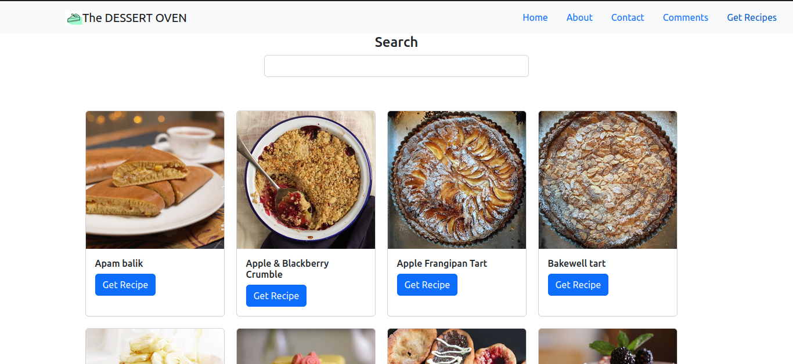

##DESSERT RECIPE 
#Requirements
A single page application (only one index.html file) using create-react-app
Use at least 5 components in a way that keeps your code well organized
There should be at least 3 client-side routes using react-router (Links to an external site.)
Use a json-server to create a RESTful API for your backend and make both a GET and a POST request to the json server. Additionally, you may choose to incorporate data from an external API but it is not required.
You should keep your json-server data simple: avoid nested data and associations. You'll learn how to work with more complex data in the next two phases. Focus on the frontend for this project.

The application is a dessert recipe that enables you to find diffrent recipes.

The list of desserts are from an external API from mealdb and are listed on Get Recipe component as below:

To the recipe there is a Get Recipe button to click and data will be displayed as below:

For the post request the app  uses  json-server to post comments/feedback as listed on comments component and the user can also delete a  commenet posted and its displayed as below:

#Styling
The app has CSS styling from scratch and also incorporate react-bootstrap

